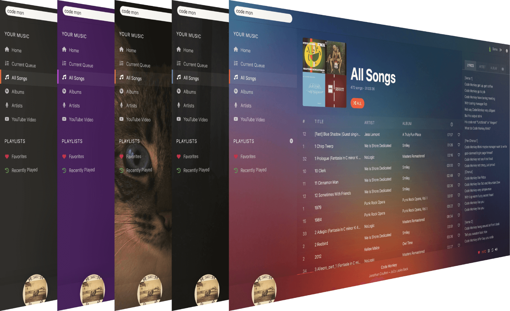

# Home


## Introduction

[**Koel**](https://koel.dev) (also styled as **koel**, with a lowercase k) is a web-based personal audio streaming service written in [Vue](https://vuejs.org/) at the client side and [Laravel](https://laravel.com/) on the server side. Targeting web developers, Koel embraces some of the more modern web technologies to do its job.

## Requirements

Koel has two components, each with its own set of requirements:

### Server

* [All requirements by Laravel](https://laravel.com) – PHP, OpenSSL, and such. Consider setting PHP's `memory_limit` to a good value (512M or better) if you have a big library.
* MySQL, MariaDB, PostgresSQL, or SQLite. Actually, any DBMS supported by Laravel should work.
* If you're [building Koel from source](#building-from-source), make sure to have [Composer](https://getcomposer.org/), Git, and NodeJS latest stable with [`yarn`](https://yarnpkg.com).

### Client

* Any evergreen browser will do – Koel has been tested on Chrome 47, Firefox 42, Safari 8, Opera 34, and Edge.

## Installation

There are three methods to install and start using Koel:

### Using a Pre-Compiled Archive

Starting from v5.0.0, Koel supports installing from a pre-compiled archive, which eliminates the need of manually compiling the front-end assets.

First, go to the [Releases page](https://github.com/koel/koel/releases) on GitHub, download either the `.tar.gz` or `.zip` file found under "Assets," and unzip it into the destination web root directory. From there, run the two following commands:

```bash
php artisan koel:init --no-assets # Populate necessary configurations during the process
php artisan serve
```

### Building from Source

From your console, run the following commands:

```bash
cd <KOEL_ROOT_DIR>
git clone https://github.com/koel/koel.git .
git checkout latest # Check out the latest version at https://github.com/koel/koel/releases
composer install
php artisan koel:init # Populate necessary configurations during the process

php artisan serve
```

In both cases, you should now be able to visit [http://localhost:8000](http://localhost:8000) in your browser and start using Koel.

:::warning Use a proper webserver
http://localhost:8000 is only the _development_ server for Koel (or rather, Laravel). For optimal performance, you'll want to set up the production version, the configuration of which varies depending on your webserver of choice (Apache, nginx, Caddy etc.) and is outside of this document's scope, but shouldn't be any different from that of a standard PHP application.</p>
:::

If you want more control, edit `.env` file. There's quite a few settings there to tweak Koel to your needs.

### Using Docker

Koel has an official Docker image: [koel/docker](https://github.com/koel/docker).

## Upgrade

Check out [Releases](https://github.com/koel/koel/releases) for upgrade guides corresponding to your Koel version and installation method.

## Configuration and Usage

### Music Discovery

There are several ways for Koel to discover your media files. You can manually scan for songs, configure a watcher, host your files with Amazon S3, or upload files directly using the web interface.

#### Scan using the web interface

:::warning
Scanning via the web interface is vulnerable to HTTP timeouts, so if you have a decent-sized library, opt for other methods instead.
:::

Upload your songs into a readable directory on your server – preferably outside of your web root dir – and configure Koel to scan and sync it by setting a "media path" under Manage ▸ Settings.


#### Scan using the CLI

You can also scan from the CLI – which is faster, without a time limit, and provides useful feedbacks – with the artisan `koel:sync` command:

```bash
$ php artisan koel:sync

   INFO  Scanning /Users/an/Personal/koel/media.

 1189/1189 [============================] 100%

   INFO  Scanning completed!

  ⇂ 0 new or updated song(s)
  ⇂ 1189 unchanged song(s)
  ⇂ 0 invalid file(s)
```

Suffix the command with a `-v` flag for more details e.g. syncing errors.

This command can be added as a cron job, for example to run every midnight:

```bash
0 0 * * * cd /home/user/webapps/koel/ && /usr/local/bin/php artisan koel:sync >/dev/null 2>&1
```

As of current, Koel recognizes these audio extensions: `.mp3`, `.ogg`, `.aac`, `.m4a`, `.opus`, and `.flac` (experimental with some limitations). Others may be added in the future.

#### Upload using the web interface
Starting from v4.3.0, you can upload songs directly as an admin by clicking the "Upload" sidebar menu item. Note that you need to set the media path first, as songs will be uploaded into the `%media_path%/__KOEL__UPLOADS__` directory.

::: tip Tip
Depending on how big your files are, you may want to set `upload_max_filesize` and `post_max_size` in your `php.ini` correspondingly, or uploading may fail with a `Payload too large` error.
:::

#### Watch a directory
Starting from v2.1.0, you can <router-link to="/watch">watch a directory</router-link> and sync on the fly with `inotifywait`.

#### Host your media on Amazon S3
Starting from v3.0.0, you can <router-link to="/aws-s3">use Koel with Amazon S3</router-link>.

### Streaming Music

Koel supports three streaming methods which can be configured via a `STREAMING_METHOD` setting in `.env` file:

* `php`: Use native PHP `readfile()`. This is the default method, and the slowest and most unstable one. **Only use this method if you can't others.**

* `x-accel-redirect`: Use nginx's [X-Accel](https://www.nginx.com/resources/wiki/start/topics/examples/x-accel/) module. Refer to [`nginx.conf.example`](https://github.com/koel/koel/blob/master/nginx.conf.example) for a sample nginx configuration file.

* `x-sendfile`: Use Apache's [mod_xsendfile](https://tn123.org/mod_xsendfile/) module. You'll need to install and configure the module manually. A sample configuration is as following:

    ```ApacheConf
    LoadModule xsendfile_module   libexec/apache2/mod_xsendfile.so

    # These configuration can be put in the VirtualHost directive as well
    <IfModule mod_xsendfile.c>
      XSendFile on
      XSendFilePath /mnt/media
    </IfModule>
    ```
::: tip Tip
If you're using a [Koel mobile app](https://koel.dev/#mobile) and can't play the songs, try switching the streaming method to `x-accel-redirect` or `x-sendfile` instead of `php`.
:::

:::warning Notice
`STREAMING_METHOD` doesn't have effects if you're transcoding or serving songs from Amazon S3.
:::

### Transcoding FLAC

Koel by default will transcode FLAC to mp3 on the fly when streaming music. This behavior can be controlled via a `TRANSCODE_FLAC` setting in `.env` file:

* `true`: Enables FLAC transcoding. Koel will transcode FLAC to mp3 on the fly. This is the default behavior.

* `false`: Disables FLAC transcoding. Koel will stream original FLAC files.

### Using the Web Interface

Using the client component of Koel should be straightforward enough. If you've ever used Spotify, you should feel right at home. As a matter of fact, Koel's client interface is a shameless rip-off of Spotify's. You can search, you can sort, you can view by artists or albums, you can create playlists, you can like/unlike songs, and you can create other users to share the vibes. There are a couple of shortcut keys, too, for the nerds:

* <kbd>F</kbd> puts the focus into the search box
* <kbd>Enter</kbd> plays a song. If multiple songs are being selected, <kbd>Enter</kbd> adds them to the bottom of the queue, <kbd>Shift</kbd>+<kbd>Enter</kbd> queues them to top. Adding a <kbd>Cmd</kbd> or <kbd>Ctrl</kbd> into the combo plays the first selected song right away.
* <kbd>Space</kbd> toggles playback
* <kbd>J</kbd> plays the next song in queue
* <kbd>K</kbd> plays the previous song in queue
* <kbd>Ctrl/Cmd</kbd>+<kbd>A</kbd> selects all songs in the current view
* <kbd>Delete</kbd> removes selected song(s) from the current queue/playlist

With a browser that supports [MediaSession](https://developer.mozilla.org/en-US/docs/Web/API/MediaSession), you can control Koel using hardware media keys without even having Koel _or the browser_ focused.

### Instant Search

Starting from v5.0.0, Koel provides an instant search feature that performs full-text, fuzzy searches against your database of songs, albums, and artists. By default, Koel uses the [TNTSearch engine](https://github.com/teamtnt/tntsearch), which requires no configuration. You can also use [Algolia](https://www.algolia.com/) by populating these details into `.env`:

```
SCOUT_DRIVER=algolia
ALGOLIA_APP_ID=<your-algolia-app-id>
ALGOLIA_SECRET=<your-algolia-secret>
```

Similarly, you can use [Meilisearch](https://www.meilisearch.com/) with these configurations:

```
SCOUT_DRIVER=meilisearch
MEILISEARCH_HOST=<your-meilisearch-host>
MEILISEARCH_KEY=<your-meilisearch-key>
```

If you're upgrading Koel from an older version, you'll also have to create the search indices manually by running this command:

```bash
php artisan koel:search:import
```

All subsequent updates to the music database will be synchronized automatically.

### Themes



Koel supports multiple themes. You can preview and choose one from from the Profile & Preferences screen. Note that themes are not persisted across devices, as they make use of the browser's local storage.

### Upload Artist and Album Images

You can change the artist and album images by dragging and dropping images into the current images in artist/album cards.

### User Management

Koel supports multiple users. A user can be an _admin_ who has administrative privileges (user and media management) or a _standard_ one. As of current, all users share the same library (though playlists, favorites, and other stats are private). Full multi-tenant support may be considered in the future.

### Remote Controller

Starting from v3.7.0, Koel has a (mobile) remote controller that lets you control a desktop instance – play/pause, navigate, turn volume up/down, and add/remove from Favorites.


In order to use the feature:

1. [Register a Pusher account](https://www.pusher.com) and create an app
1. Populate the app's credentials into `.env` (those start with `PUSHER_`)
1. Reload the desktop Koel instance
1. Go to http://&lt;your-koel-host&gt;/remote on a mobile device to start controlling remotely. You may also want to add the URL to the home screen for faster access later.

### Reset Admin Password

Starting from v4.1.1, Koel comes with a handy CLI command to reset the admin password in case you lose it:

```bash
php artisan koel:admin:change-password
```

For older versions, you can make use of Laravel's Tinker, as described [here](https://github.com/koel/koel/issues/1107#issuecomment-542783495).

## Mobile Support and Limitation

Koel's fully responsive GUI works fairly well on a mobile device. Certain functionalities are not available (yet), however:

* Shortcut keys don't work (duh)
* Volume can only be controlled from a system level
* Next and previous songs can't be controlled from Control Center or lock screen

Also, since [Safari is the new IE](https://www.safari-is-the-new-ie.com/), if you're on iOS, it's strongly advised to use Koel with a non-Safari browser such as [Firefox](https://apps.apple.com/us/app/firefox-private-safe-browser/id989804926), [Microsoft Edge](https://apps.apple.com/us/app/microsoft-edge/id1288723196), [Brave](https://apps.apple.com/us/app/brave-vpn-private-web-browser/id1052879175), or [Google Chrome](https://apps.apple.com/us/app/google-chrome/id535886823). iOS 14 comes with the ability to change the default browser as well.

For a better mobile experience, it's strongly recommended to use one of the [official mobile apps](https://github.com/koel/player) instead.

## Local Development

### Running the Local Webserver

Start both the PHP server and the client application in one go with `yarn dev`, which uses [`start-server-and-test`](https://github.com/bahmutov/start-server-and-test) to manage both [vite](https://vitest.dev/) and Laravel:

```bash
$ yarn dev
  vite v2.9.13 dev server running at:

  > Local: http://localhost:3000/
  > Network: use `--host` to expose

  ready in 761ms.


  Laravel v9.22.1

  > APP_URL: http://localhost:8000
```

A development version of Koel should now be available at `http://localhost:8000` with full HMR support.

### Testing, Linting, Static Analysis and Stuff

```bash
# PHP-related code quality tasks
# Basically, take a look at the "scripts" section in composer.json
composer test        # Run the PHP test suite
composer cs          # Run code style checker
composer cs:fix      # Run code style fixer
composer analyze     # Run PHP static analysis

yarn build # Build a production version of the client application

# Client/E2E code quality tasks
# You may want to run `yarn build` first.
yarn test:e2e        # Run the Cypress test suite interactively
yarn test:e2e:ci     # Run the Cypress test suite non-interactively (CI mode)
# These commands need to be run from within the submodule (resources/assets)
yarn lint            # Lint
yarn type-check      # TypeScript type checking
yarn test            # Unit testing
```

## Credits

Koel is built on the shoulder of the giants. My sincere thanks go to the folks behind Vue, Laravel, as well as all JavaScript and PHP packages used in the project.

## Sponsors and Support

The continuous development of Koel is made possible thanks to the support from these generous sponsors:

[](https://render.com)

[](https://www.keycdn.com/?a=11519)

Want to help out as well? You can support Koel's development via [OpenCollective](https://opencollective.com/koel) or [GitHub Sponsors](https://github.com/users/phanan/sponsorship).


<style>
img[src*="#remote-controller"] {
   width: 320px;
   height: auto;
}
</style>
