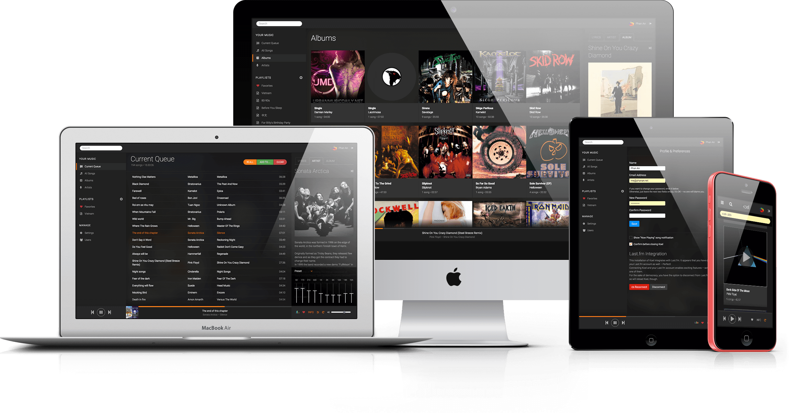

# Home



## Introduction

[**Koel**](https://koel.dev) (also styled as **koel**, with a lowercase k) is a web-based personal audio streaming service written in [Vue](https://vuejs.org/) at the client side and [Laravel](https://laravel.com/) on the server side. Targeting web developers, Koel embraces some of the more modern web technologies – flexbox, audio and drag-and-drop API to name a few – to do its job.

## Requirements

Koel has two components, each with its own set of requirements:

### Server

* [All requirements by Laravel](https://laravel.com) – PHP, OpenSSL, [composer](https://getcomposer.org/) and such. Consider setting PHP's `memory_limit` to a good value (512M or better) if you have a big library.
* MySQL, MariaDB, PostgresSQL, or SQLite. Actually, any DBMS supported by Laravel should work.
* NodeJS latest stable with [`yarn`](https://yarnpkg.com)

### Client

* Any decent web browser will do – Koel has been tested on Chrome 47, Firefox 42, Safari 8, Opera 34, and Edge.

## Installation

### Manually

From your console, run the following commands:

```bash
cd <KOEL_ROOT_DIR>
git clone --recurse-submodules https://github.com/koel/koel.git .
git checkout latest # Check out the latest version at https://github.com/koel/koel/releases
composer install
php artisan koel:init # Populate credentials during the process

php artisan serve
```

You should now be able to visit [http://localhost:8000](http://localhost:8000) in your browser and start using Koel.

:::warning Use a proper webserver
http://localhost:8000 is only the _development_ server for Koel (or rather, Laravel). For optimal performance, you'll want to set up the production version, the configuration of which varies depending on your webserver of choice (Apache, nginx, Caddy etc.) and is outside of this document's scope, but shouldn't be any different from that of a standard PHP application.</p>
:::

If you're on Debian, here's an [unofficial installation guide](https://gist.github.com/bplower/613a99156d603abac083). This may or may not be out of date, so use it with your own risk.

If you want more control, edit `.env` file. There's quite a few settings there to tweak Koel to your needs. Remember to reload the server for the changes to take effects.

### Docker

Koel doesn't maintain an official Docker image, but community-supported ones like [hyzual/koel](https://hub.docker.com/r/hyzual/koel/), [0xcaff/koel](https://hub.docker.com/r/0xcaff/koel/), and [binhex/arch-koel](https://hub.docker.com/r/binhex/arch-koel/) are available.

## Upgrade

Check out [Releases](https://github.com/koel/koel/releases) for upgrade guides corresponding to your Koel version.

## Configuration and Usage

### Music Discovery

There are several ways for Koel to discover your media files. You can manually scan for songs, configure a watcher, host your files with Amazon S3, or upload files directly using the web interface.

#### Scan for Songs

The default music discovery method. Upload your songs into a readable directory on your server – preferably outside of your web root dir – and configure Koel to scan and sync it by setting a "media path" under Manage ▸ Settings.


You can also scan from the CLI – which is faster, without a time limit, and provides feedbacks – with the artisan `koel:sync` command:

```bash
$ php artisan koel:sync
Koel syncing started.

 953/953 [▓▓▓▓▓▓▓▓▓▓▓▓▓▓▓▓▓▓▓▓▓▓▓▓▓▓▓▓] 100%

Completed! 944 new or updated song(s), 0 unchanged song(s), and 9 invalid file(s).
```

Suffix the command with a `-v` flag for more details e.g. syncing errors.

This command can also be added as a cron job, for example to run every midnight:

```bash
0 0 * * * cd /home/user/webapps/koel/ && /usr/local/bin/php artisan koel:sync >/dev/null 2>&1
```

As of current, Koel recognizes these audio extensions: `.mp3`, `.ogg`, `.m4a` (experimental), and `.flac` (experimental with some limitations). Others may be added in the future.

If you're syncing compilation albums (albums with multiple songs from different artists) make sure the "Band" tag is set, otherwise each song will end up in its own album. Some ripping software set this automatically; check if yours does.

#### Watch a directory
Starting from v2.1.0, you can <router-link to="/watch">watch a directory</router-link> and sync on the fly with `inotifywait`.

#### Host your media on Amazon S3
Starting from v3.0.0, you can <router-link to="/aws-s3">use Koel with Amazon S3</router-link>.

#### Upload using the web interface
Starting from v4.3.0, if you're logged in as an admin, you can upload songs directly by clicking the "Upload" sidebar menu item. Note that you need to set the media path first, as songs will be uploaded into a `%media_path%/__KOEL__UPLOADS__` directory.

::: tip Tip
Depending on how big your media files are, you may want to set `upload_max_filesize` and `post_max_size` in your `php.ini` correspondingly, or PHP may fail with a `Payload too large` error. 
:::

### Streaming Music

Koel supports three streaming methods which can be configured via a `STREAMING_METHOD` setting in `.env` file:

* `php`: Use native PHP `readfile()`. This is the default method, and the slowest and most unstable one. **Only use this method if you can't others.**
* `x-sendfile`: Use Apache's [mod_xsendfile](https://tn123.org/mod_xsendfile/) module. You'll need to install and configure the module manually. A sample configuration is as following:

    ```ApacheConf
    LoadModule xsendfile_module   libexec/apache2/mod_xsendfile.so

    # These configuration can be put in the VirtualHost directive as well
    <IfModule mod_xsendfile.c>
      XSendFile on
      XSendFilePath /mnt/media
    </IfModule>
    ```

* `x-accel-redirect`: Use nginx's [X-Accel](https://www.nginx.com/resources/wiki/start/topics/examples/x-accel/) module. Refer to [`nginx.conf.example`](https://github.com/koel/koel/blob/master/nginx.conf.example) for a sample nginx configuration file.

:::warning Notice
`STREAMING_METHOD` doesn't have effects if you're serving songs from Amazon S3.
:::

### Using the Web Interface

Using the client component of Koel should be straightforward enough. If you've ever used Spotify, you should feel right at home. As a matter of fact, Koel's client interface is a shameless rip-off of Spotify's. You can search, you can sort, you can view by artists or albums, you can create playlists, you can like/unlike songs, and you can create other users to share the vibes. There are a couple of shortcut keys, too, for the nerds:

* <kbd>F</kbd> puts the focus into the search box
* <kbd>Enter</kbd> plays a song. If multiple songs are being selected, <kbd>Enter</kbd> adds them to the bottom of the queue, <kbd>Shift</kbd>+<kbd>Enter</kbd> queues them to top. Adding a <kbd>Cmd</kbd> or <kbd>Ctrl</kbd> into the combo plays the first selected song right away.
* <kbd>Space</kbd> toggles playback
* <kbd>J</kbd> plays the next song in queue
* <kbd>K</kbd> plays the previous song in queue
* <kbd>Ctrl/Cmd</kbd>+<kbd>A</kbd> selects all songs in the current view
* <kbd>Delete</kbd> removes selected song(s) from the current queue/playlist

On a modern browser, you can control Koel using hardware media keys without even having Koel _or the browser_ focused.

### Instant Search

Starting from v5.0.0, Koel provides an instant search feature, which perform full-text, fuzzy matches against your database of songs, albums, and artists. By default, Koel uses the [TNTSearch engine](https://github.com/teamtnt/tntsearch), which requires no configuration. You can also use [Algolia](https://www.algolia.com/) by populating these details into `.env`:

```
SCOUT_DRIVER=algolia
ALGOLIA_APP_ID=<your-algolia-app-id>
ALGOLIA_APP_ID=<your-algolia-secret>
```

If you're upgrading Koel from an older version, you'll also have to create the search indices manually by running this command:

```bash
php artisan koel:search:import
```

All subsequent updates to the music database will be synchronized automatically.

### Upload Artist and Album Images

You can change the artist and album images by dragging and dropping images into the current images in artist/album cards.

### Remote Controller

Starting from v3.7.0, Koel has a (mobile) remote controller that lets you control a desktop instance – play/pause, navigate, turn volume up/down, and add/remove from Favorites.


In order to use the feature:

1. [Register a Pusher account](https://www.pusher.com) and create an app
1. Populate the app's credentials into `.env` (those start with `PUSHER_`)
1. Reload the desktop Koel instance
1. Go to http://&lt;your-koel-host&gt;/remote on a mobile device to start controlling remotely. You may also want to add the URL to the home screen for faster access later.

### Reset Admin Password

Starting from v4.1.1, Koel comes with a handy CLI command to reset the admin password in case you lose it:

```bash
php artisan koel:admin:change-password
```

For older versions, you can make use of Laravel's Tinker, as described [here](https://github.com/koel/koel/issues/1107#issuecomment-542783495).

## Mobile Support and Limitation

Koel's fully responsive GUI works fairly well on a mobile device. Certain functionalities are not available (yet), however:

* Shortcut keys don't work (duh)
* Equalizer may *not* work
* Volume must be controlled from a system level
* Next and previous songs can't be controlled from Control Center or lock screen

Also, since [Safari is the new IE](https://www.safari-is-the-new-ie.com/), if you're on iOS, it's strongly advised to use Koel with a non-Safari browser such as [Firefox](https://apps.apple.com/us/app/firefox-private-safe-browser/id989804926), [Microsoft Edge](https://apps.apple.com/us/app/microsoft-edge/id1288723196), [Brave](https://apps.apple.com/us/app/brave-vpn-private-web-browser/id1052879175), or [Google Chrome](https://apps.apple.com/us/app/google-chrome/id535886823). iOS 14 comes with the ability to change the default browser as well.

## Local Development

### Running the Local Webserver

Since Koel makes use of [git submodules](https://git-scm.com/book/en/v2/Git-Tools-Submodules), you'll want to make sure the submodule is up-to-date:

```bash
git pull
git submodule update --init --recursive --remote

# install the submodule dependencies
cd resources/assets
yarn install
```

To start the **PHP dev server**, which serves as the API of the application, run the following command from the root directory. By default, the server will listen at port `8000`.

```bash
php artisan serve
```

For the **client application** itself, run this command:

```bash
yarn hot
```

A development version of Koel should now be available at `http://localhost:8080` with full support for hot module reloading.

Alternatively, you can start both the PHP server and the client application in one go with `yarn dev`, which uses [`start-server-and-test`](https://github.com/bahmutov/start-server-and-test) under the hood.

### Testing, Linting, Static Analysis and Stuff

```bash
# PHP-related code quality tasks
# Basically, take a look at the "scripts" section in composer.json
composer test        # Run the PHP test suite
composer cs          # Run code style checker
composer cs:fix      # Run code style fixer 
composer analyze     # Run PHP static analysis

yarn build # Build a production version of the client application

# Client/E2E code quality tasks
# You may want to run `yarn build` first.
yarn test:e2e        # Run the Cypress test suite interactively
yarn test:e2e:ci     # Run the Cypress test suite non-interactively (CI mode)
# These commands need to be run from within the submodule (resources/assets)
yarn lint            # Lint
yarn type-check      # TypeScript type checking
yarn test            # Unit testing
```

::: tip 
If you're already running `yarn test:e2e`, there's no need to start a dev server. `yarn test:e2e` calls `yarn dev` internally and will eliminate the existing `yarn dev` process, if any. 
:::

## Credits

Koel is built on the shoulder of the giants. My sincere thanks go to the folks behind Vue, Laravel, as well as all JavaScript and PHP packages used in the project.

## Sponsors and Support

The continuous development of Koel is made possible thanks to the support of these awesome sponsors:

<a href="https://www.exoscale.ch/"></a>
<a href="https://www.keycdn.com/?a=11519"><svg xmlns="http://www.w3.org/2000/svg" class="svg-logo" viewBox="0 0 137.09 39.849" style="height: 55px">
    <path fill="#2e3234" d="M3.971 32.104c.39.016.784.07 1.151.205v-.004l.056.02 4.842-4.723.178.237c.251.34.518.651.8.962l.103.119c.074.074.133.148.207.222l.12.118.117.119.104.103.118.119.104.103.133.119.12.104a12.868 12.868 0 0 0 8.025 3.065 12.983 12.983 0 0 0 6.915-1.792l.37.385c.43.459.874.918 1.304 1.377a15.234 15.234 0 0 1-8.648 2.414 15.224 15.224 0 0 1-9.418-3.554l.015-.03-3.107 3.063a3.873 3.873 0 1 1-3.707-2.752h.1zM33.58 12.127a15.231 15.231 0 0 1 2.206 8.323 15.172 15.172 0 0 1-3.805 9.684l.015.015 1.91 2.029c.77-.104 1.54.162 2.073.725a2.405 2.405 0 0 1-.089 3.391 2.405 2.405 0 0 1-3.39-.089 2.388 2.388 0 0 1-.608-2.102 739.91 739.91 0 0 0-3.36-3.569l-.194-.207.222-.178a12 12 0 0 0 1.6-1.525 12.818 12.818 0 0 0 3.243-8.233 12.84 12.84 0 0 0-1.6-6.575zM6.597 3.076c.68-.01 1.32.259 1.794.744a2.39 2.39 0 0 1 .607 2.103l3.673 3.85-.223.178c-.577.459-1.11.962-1.599 1.525a12.927 12.927 0 0 0-1.658 14.822l-1.763 1.718a15.112 15.112 0 0 1-2.22-8.366c.076-3.565 1.465-7.009 3.798-9.691l-2.022-2.11a2.406 2.406 0 0 1-2.073-.727 2.405 2.405 0 0 1 .09-3.391 2.43 2.43 0 0 1 1.367-.64c.076-.008.153-.01.23-.016zM37.498 0a3.873 3.873 0 1 1-1.208 7.553v.005l-.06-.021-5.257 4.99-.178-.237c-.28-.37-.592-.74-.918-1.08l-.06-.075-.162-.163-.296-.296-.104-.089-.103-.088-.133-.119-.104-.089-.134-.118a12.862 12.862 0 0 0-7.966-3.021c-2.444-.06-4.828.548-6.9 1.792l-1.689-1.763a15.233 15.233 0 0 1 8.648-2.414 15.154 15.154 0 0 1 9.418 3.569h.03l3.48-3.305A3.873 3.873 0 0 1 37.5 0z"></path>
    <path fill="#047aed" d="M20.617 8.646c.438.002.875.036 1.309.086 6.249.785 10.676 6.486 9.906 12.735-.785 6.25-6.486 10.677-12.735 9.907-6.249-.785-10.677-6.487-9.907-12.735.746-5.797 5.616-9.973 11.427-9.993zm-.171 4.894c-2.53.203-4.36 2.116-4.425 4.659.04 1.766.802 3.013 2.246 3.989l.348.189-.88 4.139h5.901l-.879-4.14c1.62-.834 2.547-2.365 2.593-4.177-.034-2.624-2.064-4.6-4.664-4.665l-.24.006zm.088-.025h-.015.015zM50.991 14.514c-.287 0-.489.058-.834.518l-4.772 6.21 2.07-11.644c.086-.431-.144-.575-.489-.575h-4.313c-.517 0-.66.259-.718.575l-3.709 21.016c-.086.46.201.633.517.633h4.313c.316 0 .632-.317.69-.633l1.15-6.555 2.501 6.555c.173.46.403.633.719.633h5.175c.374 0 .517-.345.374-.633l-3.68-8.05 6.555-7.446c.23-.23.201-.604-.202-.604zm20.014 5.923c0-3.422-1.955-6.182-6.124-6.182-4.801 0-8.079 2.128-9.027 7.82l-.317 1.898a8.854 8.854 0 0 0-.115 1.466c0 4.083 3.163 6.066 6.354 6.066 2.415 0 4.37-.287 6.296-.89.489-.145.633-.346.719-.806l.46-2.587v-.115c0-.26-.173-.374-.431-.374h-.115c-1.093.115-3.997.23-5.52.23-1.438 0-2.358-.201-2.358-1.639 0-.259.029-.546.086-.891h8.942a.737.737 0 0 0 .718-.633l.288-1.725c.086-.546.144-1.092.144-1.638zm-5.175-.202c0 .345-.058.748-.144 1.15h-4.255c.345-1.638 1.035-2.846 2.645-2.846 1.294 0 1.754.69 1.754 1.696zm24.527-5.29c0-.23-.259-.43-.517-.43h-4.744c-.316 0-.604.23-.719.545l-4.111 10.408h-.23c-.172 0-.201-.144-.23-.489l-.518-9.89c-.028-.316-.143-.575-.46-.575h-4.627c-.489 0-.719.23-.719.546v.087l1.667 13.685c.173 1.466.92 1.983 2.272 1.983h.374l-.403.95c-.345.833-.949 1.092-1.754 1.092-1.092 0-2.817-.173-3.881-.23h-.029c-.345 0-.69.287-.747.603l-.489 2.79v.085c0 .26.259.345.546.46.748.288 2.645.518 3.795.518 4.514 0 6.153-1.783 7.562-4.859l7.906-17.077a.533.533 0 0 0 .057-.202z"></path>
    <path fill="#2e3234" d="M103.13 15.175c0-.287-.173-.373-.489-.46-.776-.2-2.156-.46-3.853-.46-4.427 0-7.273 2.214-8.193 7.562l-.374 2.156a11.156 11.156 0 0 0-.144 1.639c0 3.363 1.955 5.893 5.664 5.893 1.696 0 3.019-.23 4.025-.46.403-.086.633-.23.69-.603l.575-3.22v-.115c0-.26-.201-.432-.46-.432h-.057c-1.007.058-1.927.173-3.335.173-.978 0-1.553-.345-1.553-1.639 0-.345.029-.747.115-1.236l.374-2.156c.402-2.387 1.236-2.904 2.472-2.904 1.409 0 2.272.144 3.249.201h.058c.316 0 .603-.23.66-.546l.576-3.249zm17.943-5.663c0-.288-.258-.49-.546-.49h-4.284c-.316 0-.603.26-.66.576l-.863 4.859c-.575-.087-1.553-.202-2.013-.202-5.232 0-7.849 2.185-8.797 7.504l-.403 2.243a9.023 9.023 0 0 0-.144 1.466c0 3.536 2.444 6.037 6.383 6.037 2.587 0 5.031-.402 6.584-.718.92-.202 1.063-.374 1.15-.92l3.594-20.27zm-7.158 9.43l-1.38 7.877c-.547.086-1.15.144-1.984.144-1.236 0-1.667-.719-1.667-1.84 0-.345.028-.719.114-1.121l.403-2.243c.287-1.667.977-2.932 2.587-2.932.69 0 1.352.057 1.927.115zm23.176.2c0-3.22-1.323-4.887-4.514-4.887-1.063 0-2.645.26-4.657 1.582l.144-.748c.086-.431-.115-.575-.49-.575h-3.938c-.316 0-.604.259-.661.575l-2.76 15.525c-.058.403.259.633.661.633h4.111c.432 0 .719-.288.777-.633l1.955-11.126c.517-.288 1.58-.633 2.443-.633.978 0 1.352.23 1.352 1.122 0 .488-.115.977-.202 1.466l-1.61 9.171c-.057.288 0 .633.489.633h4.313c.345 0 .66-.317.718-.633l1.582-8.97c.143-.805.287-1.754.287-2.501z"></path>
</svg></a>

Want to help as well? You can support Koel's development via [OpenCollective](https://opencollective.com/koel) or [GitHub Sponsors](https://github.com/users/phanan/sponsorship). 


<style>
img[src*="#remote-controller"] {
   width: 320px;
   height: auto;
}
</style>
