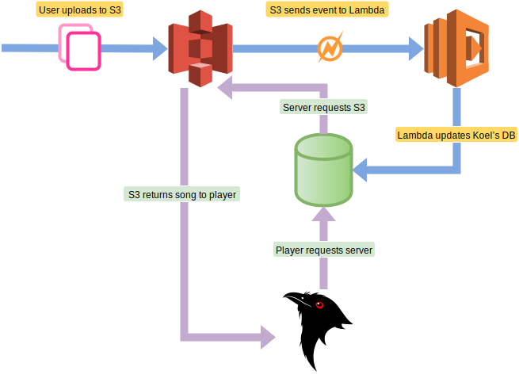

# Host Media Files on S3

Starting from version v3.0.0, Koel can work seamlessly with Amazon S3 with the help of [the official Koel-AWS package](https://github.com/koel/koel-aws). This allows you to run Koel in your server and have all media files hosted by Amazon, and save yourself some good hosting fee.

## How It Works

The easiest way to understand Koel-AWS approach is to take a look at this awesomely-drawn diagram:



## Supports and Requirements

As of current, only `mp3`, `ogg`, and `m4a` files are supported. Also, your Koel version must be v3.0.0 or later.

:::warning AWS knowledge required
You're expected to know your way around AWS's console, which, let's be honest here, can use some UX improvements. If you're stuck with an AWS-specific command, Google is your friend.
:::

## Step-by-Step Installation

### 1. Prepare S3 for streaming

1. Create an IAM user, e.g. `koel-user`
1. Create a bucket, e.g. `koel-bucket`
1. Make sure `koel-user` can read `koel-bucket`'s  content. You can simply attach the `AmazonS3ReadOnlyAccess` policy to `koel-user`.
1. Allow CORS on `koel-bucket`

    ```markup
    <CORSConfiguration>
        <CORSRule>
            <AllowedOrigin>*</AllowedOrigin>
            <AllowedMethod>GET</AllowedMethod>
            <MaxAgeSeconds>3000</MaxAgeSeconds>
            <AllowedHeader>Authorization</AllowedHeader>
        </CORSRule>
    </CORSConfiguration>
    ```

### 2. Configure Lambda for syncing

1. Clone Koel-AWS's repository: `git clone https://github.com/phanan/koel-aws`
2. Install necessary packages: `cd koel-aws && npm install --production`
3. Copy `.env.example` into `.env` and edit the variables there
4. Zip the whole directory's content into something like `archive.zip`
5. In AWS Lambda console, create a Lambda function with the following information:

    ```
    Name: koel-lambda
    Runtime: Node.js 4.3
    Code entry type: Upload a .ZIP file (you'll upload the zip file created in step 4 here)
    Handler: index.handler
    Role: S3 execution role (a new window will appear, where you can just click next next and next)
    Memory (MB): 128 should be fine
    Timeout: 0min 10sec
    VPC: "No VPC" should be fine
    ```
:::warning AWS region
Make sure you're creating the function in the same region with `koel-bucket`.
:::

### 3. Configure S3 to send events to Lambda

Under `koel-bucket` "Events" section, create an event with the following details:

    Name: <Just leave it blank>
    Events: ObjectCreated(All), ObjectRemoved(All)
    Prefix: <Empty>
    Suffix: <Empty>
    Send To: Lambda function
    Lambda function: koel-lambda

### 4. Configure Koel to be able to stream from S3

If everything works properly, you can now upload media files to the bucket and they should appear in Koel. Now after you populate `koel-user`'s `AWS_ACCESS_KEY_ID`, `AWS_SECRET_ACCESS_KEY`, and `AWS_REGION` into your Koel's `.env` file, Koel will start streaming media from your S3.

### 5. ☕️

You did it! Now go make some coffee, lay back, and enjoy the melodies.

## Contribution

I'm not an AWS expert, nor do I ever want to be one. If you spot any problem with the code or have a better idea, [do reach out](https://github.com/koel/koel-aws/issues/new).
